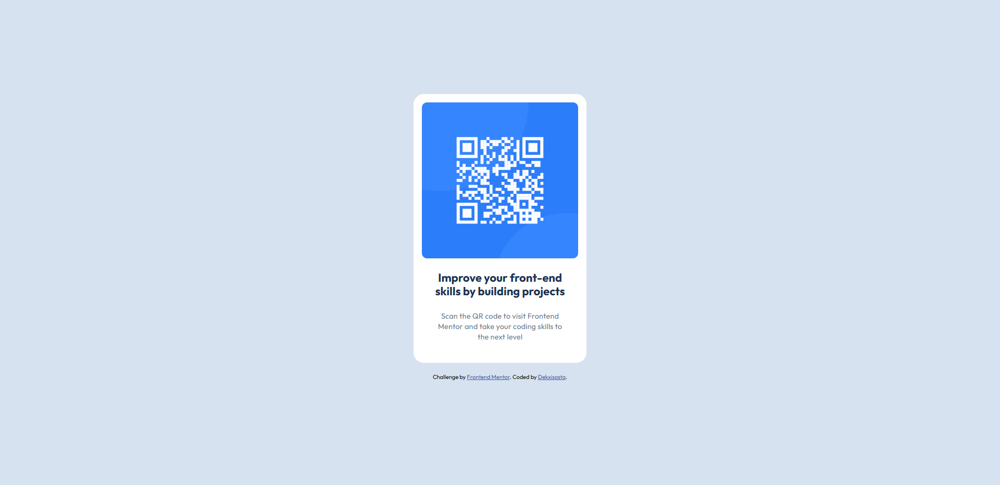

<table>
  <tr>
    <td rowspan="2"></img></td>
    <td colspan="5"><h1> Frontend Mentor Challenge - QR Code Component </h1></td>
  </tr>
  <tr>
    <td colspan="5">
      <b>[INFO]</b>
      &nbspFeel free to copy the code — I don’t really care. If you want to make tweaks or notice anything that needs fixing, go ahead and let me know.
    </td>
  </tr>
</table>

## Screenshot

## Overview
The solution must reflect the design files

## Built with
HTML5, CSS3, Flexbox

## Author
- Frontend Mentor - [@Dekxisosta](https://www.frontendmentor.io/profile/Dekxisosta)
